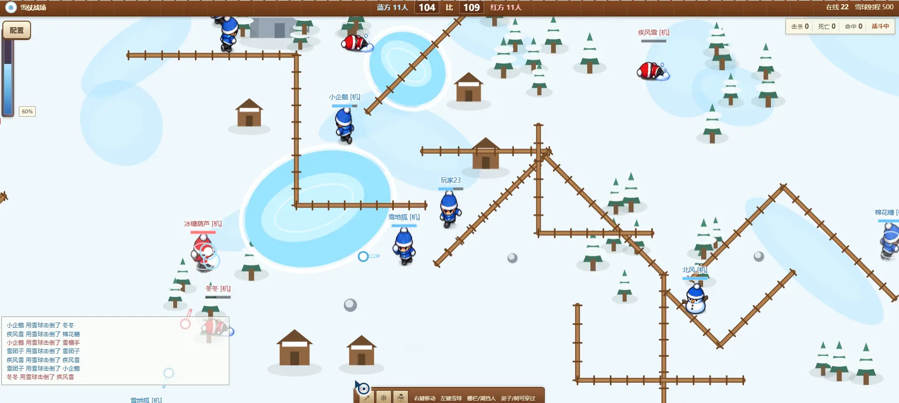
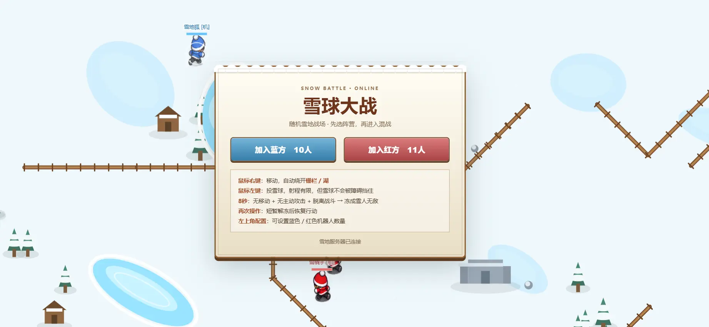
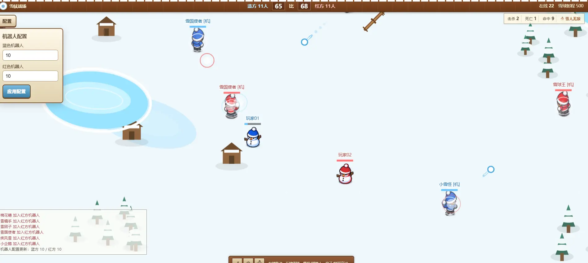
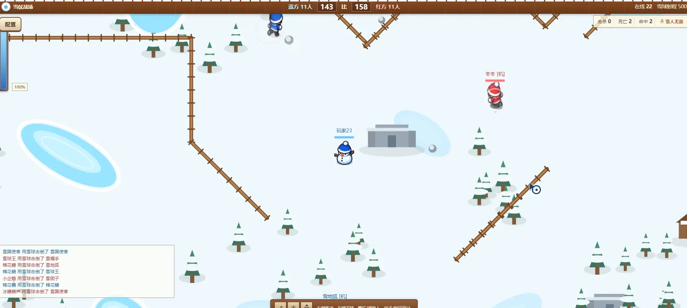
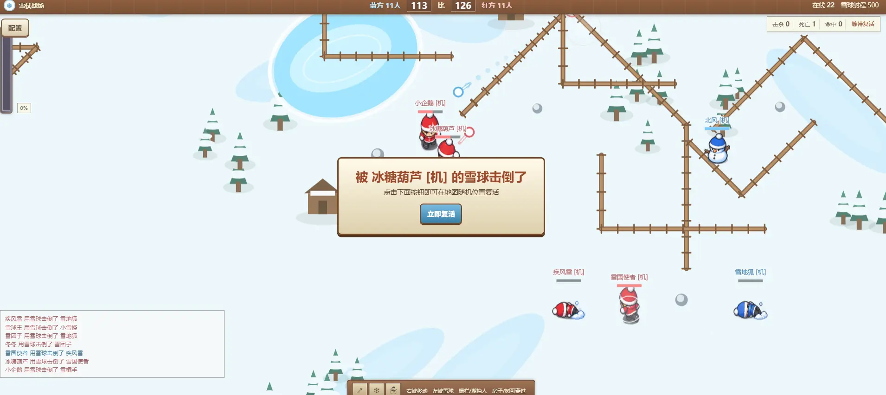

# Snowball Battle

[English](./README.md) · [简体中文](./README.zh-CN.md) · [日本語](./README.ja.md)

A lightweight multiplayer browser snowball-fight game inspired by the classic **“Snowball Fight / 打雪仗”** experience from **Kele8 (可乐8)**.

> This is an independent open-source recreation / tribute project. It is not affiliated with, endorsed by, or licensed by the original game operator or rights holders. The repository does not include program files or assets extracted directly from the original game.



## Highlights

- 🔵 **Blue vs Red** real-time team battle
- 🖱️ **Right-click to move**, **left-click to throw snowballs**
- ❄️ Fast, continuous snowball throwing with team-colored projectile outlines/trails
- ☃️ **Snowman idle protection**: after 8 seconds without movement or attacking (and while out of combat), the player freezes into an invincible snowman
- 🧊 Randomized snowfield map with lakes, fences, trees, houses, rocks and ice decorations
- 🚧 **Fences and lakes block player movement**; trees/houses are visual-only and can be crossed
- 🏹 Snowballs are not blocked by map obstacles
- 🤖 Configurable Blue / Red bots from the in-game configuration panel; default is 0 / 0
- ❤️ 100 HP, 20 damage per snowball, team scoring and personal kill/death/hit stats
- 💀 Manual respawn only for human players: click **Respawn now** after being knocked down
- 🎯 Death dialog shows who knocked you down
- 🎮 Directional sprite animation, snowman states and smooth camera/player interpolation
- 🌐 Node.js real-time server with browser Canvas rendering
- 📦 No external runtime dependencies

## Screenshots

### Join a team



### Configure bots and fight



### Snowman state



### Knocked down / manual respawn



## Controls

| Input | Action |
| --- | --- |
| Right mouse button | Move to the clicked position; pathfinding routes around fences and lakes |
| Left mouse button | Throw a snowball toward the clicked position |
| Hover an enemy | Cursor turns red to make targets easier to identify |
| Configuration button | Set Blue and Red bot counts |
| Respawn now | Manually respawn at a random valid location after death |

The browser's native context menu is disabled inside the game so right-click remains dedicated to movement.

## Core Rules

- Players choose the **Blue** or **Red** team before entering.
- There are no fixed team bases; players spawn at random valid locations.
- Snowballs travel only as far as the clicked point when it is inside the maximum range; clicks beyond the range are clamped to the maximum range.
- Multiple snowballs can exist at the same time. You do not need to wait for the previous snowball to disappear.
- A snowball damages enemies only; teammates are not harmed.
- Human players do **not** auto-respawn. They remain dead until **Respawn now** is clicked.
- Bots may auto-respawn so a test match can continue unattended.
- Snowman protection activates after **8 seconds** with no movement and no attack while out of combat.
- A frozen snowman is invulnerable. Moving or attacking starts the thaw process.

## Current Gameplay Values

| Setting | Value |
| --- | ---: |
| HP | 100 |
| Snowball damage | 20 |
| Maximum snowball range | 500 |
| Snowman idle timer | 8 seconds |
| Out-of-combat requirement | ~5 seconds |
| Spawn protection | ~1.8 seconds |
| Default bots | Blue 0 / Red 0 |

## Quick Start

### Requirements

- Node.js **18+**
- A modern desktop browser (Chrome / Edge recommended)

### Run locally

```bash
git clone https://github.com/yua3891/snowball-battle.git
cd snowball-battle
npm start
```

Then open:

```text
http://localhost:8080
```

On Windows, you can also double-click `start.bat`.

### Custom port

```bash
PORT=8090 npm start
```

### Docker

```bash
docker build -t snowball-battle .
docker run --rm -p 8080:8080 snowball-battle
```

## Project Structure

```text
snowball-battle/
├─ assets/                 # Character / snowman / cursor / effect assets
├─ docs/screenshots/       # README demo screenshots
├─ game.js                 # Client rendering, controls, prediction and UI
├─ server.js               # Realtime game server, AI, damage and state sync
├─ index.html              # Game page
├─ styles.css              # UI styles
├─ package.json
├─ Dockerfile
├─ start.bat
├─ PRODUCT.md              # Product / gameplay rules
├─ LICENSE                 # Official MIT License (English)
├─ LICENSE.zh-CN.md        # Unofficial Chinese explanation/translation
└─ LICENSE.ja.md           # Unofficial Japanese explanation/translation
```

## Technical Notes

The current implementation intentionally stays small and dependency-free:

- **Client:** HTML + CSS + JavaScript + Canvas
- **Server:** Node.js built-in HTTP + WebSocket framing
- **Networking:** server-authoritative damage, projectile and player state
- **Movement:** local prediction for the current player, interpolation/extrapolation for remote players, smoothed camera following
- **Pathfinding:** grid-based routing around movement-blocking fences/lakes

The project is suitable for learning, prototyping, nostalgic browser-game recreation, and further multiplayer-game experimentation.

## Inspiration & Disclaimer

Snowball Battle is inspired by the gameplay feel of the classic **Kele8 (可乐8) “打雪仗”** browser game. The goal is to recreate the fun interaction pattern—team snowball fighting, mouse movement, directional characters and snowman protection—in a modern, readable open-source implementation.

This project is **not** an official Kele8 project. It does not claim ownership of the original game, its brand, characters, trademarks or other protected material. References to Kele8 / 可乐8 are used only to describe the historical inspiration.

If you believe any bundled material creates a rights issue, please open an issue so it can be reviewed and replaced if necessary.

## Contributing

Issues and pull requests are welcome. Useful areas to improve include:

- movement/camera feel and latency handling
- sprite alignment and throw/run animation quality
- map generation and bot behavior
- room/match lifecycle
- mobile/touch controls
- sound and additional visual feedback

## License

Released under the **MIT License**. See [`LICENSE`](./LICENSE).

Translations / explanations:

- [简体中文 MIT 说明](./LICENSE.zh-CN.md)
- [日本語 MIT 説明](./LICENSE.ja.md)

The English `LICENSE` file is the legally authoritative license text.


---

<table>
  <tr>
    <th align="center">加微信交流</th>
    <th align="center">支持开源（微信）</th>
    <th align="center">支持开源（支付宝）</th>
  </tr>
  <tr>
    <td align="center"></td>
    <td align="center"></td>
    <td align="center"></td>
  </tr>
</table>

### 关注我们

<table>
  <tr>
    <th align="center">公众号</th>
    <th align="center">视频号</th>
    <th align="center">抖音</th>
  </tr>
  <tr>
    <td align="center"></td>
    <td align="center"></td>
    <td align="center"></td>
  </tr>
</table>